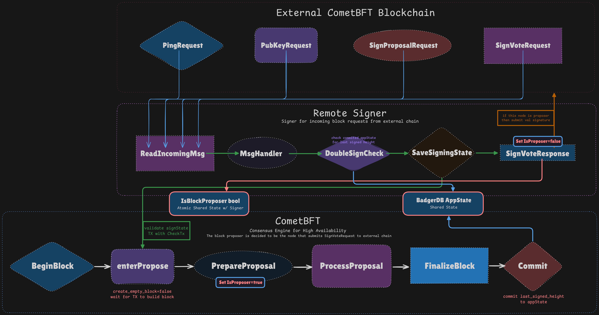

# CometKMS - Remote Key Management Service

> ❗️ **Warning:** FOR DEMO AND TESTING PURPOSES ONLY
> DO NOT USE IN PRODUCTION

Current Diagram:



This is under development to be a (high availability) remote signer that uses CometBFT consensus algorithm for the HA layer.
CometBFT decides which node will sign the block requested by an external CometBFT chain and returns the signed block to the chain.
The last signed state is stored as tx in BadgerDB appState as a key-value pair similar to:

```
key: <height>:<round>:<step(type)>
value: {
  "height": <height>,
  "round": <round>,
  "step": <step>,
  "signature": <signature>
}
```

## Initial Setup

```bash
cometkms init -p <init_path> -n <number_of_nodes>
```

This only initializes the nodes and creates the genesis file.
You still need to update ports and addresses in the `config.toml` file of each node.
Remember this is a separate CometBFT chain running underneath as a consensus layer for the remote signer software, not the chain you want to sign for.

To run the nodes, you can use the following command:

```bash

cometkms -c <cmt_home> -a <signer_addr> -k <signer_key_file> -r <signer_rpc>
```

<cmt_home> can use the <init_path>/node<0|1|2...> from the previous command for local testing.

Start Help:

```bash
Flags:
  -c, --cmt-home string          Path to the CometBFT config directory (if empty, uses $HOME/.cometbft)
  -a, --signer-addr string       Address of the remote signer (example: tcp://127.0.0.1:12345)
  -k, --signer-key-file string   Path to the private key file for the remote signer (default: $HOME/.cometbft/priv_validator_key.json)
  -r, --signer-rpc string        RPC address of the remote signer RPC for TX submission (example: http://127.0.0.1:26657)
```

## TODO

- [ ] Bundle prevote/precommit signatures to the same block proposer and the same height/round/step TX.
- [ ] document consensus configuration for underlying CometBFT chain.
- [ ] Dont return error if this node isnt supposed to sign the block, should be handled at pubkey request (or find another way to handle this).
- [ ] ...
